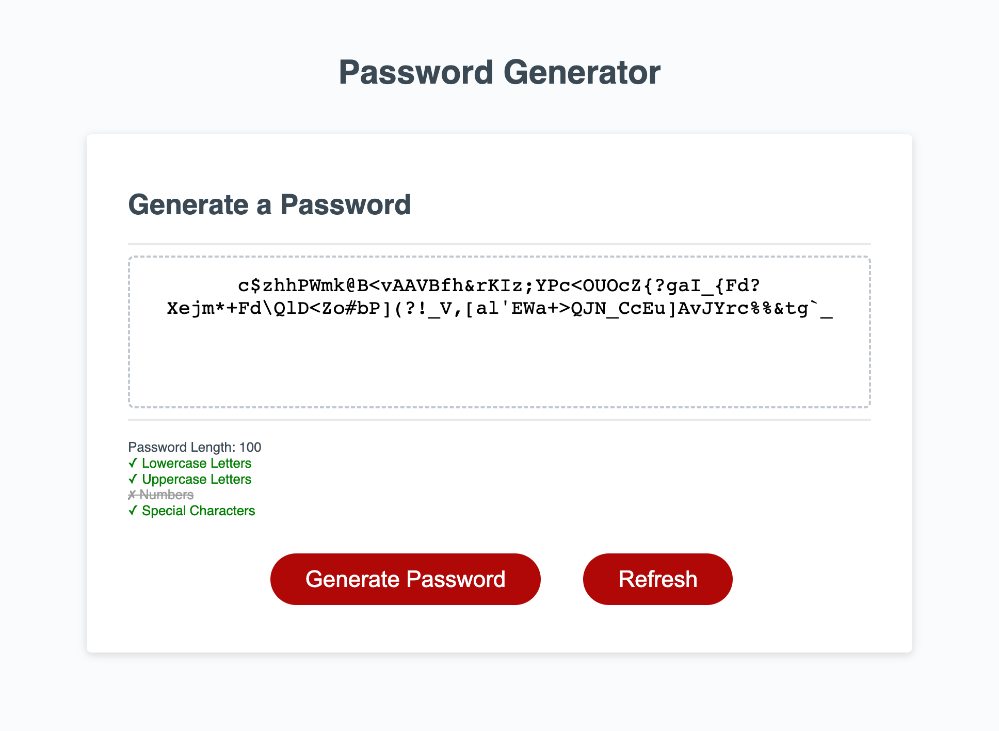

# Password Generator

## Description
[Click here to visit the live website.](https://jacob-medina.github.io/password-generator/)

This project is a website that can generate a randomized password based on criteria that the user enters.

The aim of the password generator is to create more varied and less predictable passwords for users. The user can also specify the length and type of characters they want included in the password, which is helpful if there are password restrictions or requirements. The password generation algorithm ensures that the password includes at least one of each character type the user requests.

## Usage

Users may do the following:
- Resize the window to get a layout that is appropriate for the screen dimensions
- Click the **Generate Password** button to be asked a series of prompts:
  1. Password length (8 - 128 characters)
  2. Include lowercase letters
  3. Include uppercase letters
  4. Include numbers
  5. Include special characters
- Click the **Refresh** button to generate another password based on the previously entered criteria
- Highlight and copy the password text for future use

## Code Source

The three files that were edited in this project were `index.html`, `style.css`, and `script.js`.

These files can be found through the following path (from root):
- `index.html`
- `assets/css/style.css`
- `assets/scripts/script.js`

## Credits

Starter code created by edX Boot Camps LLC.